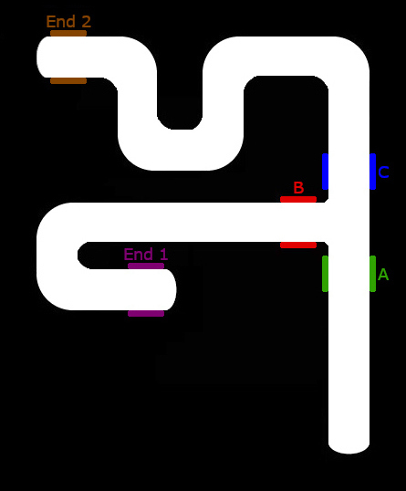
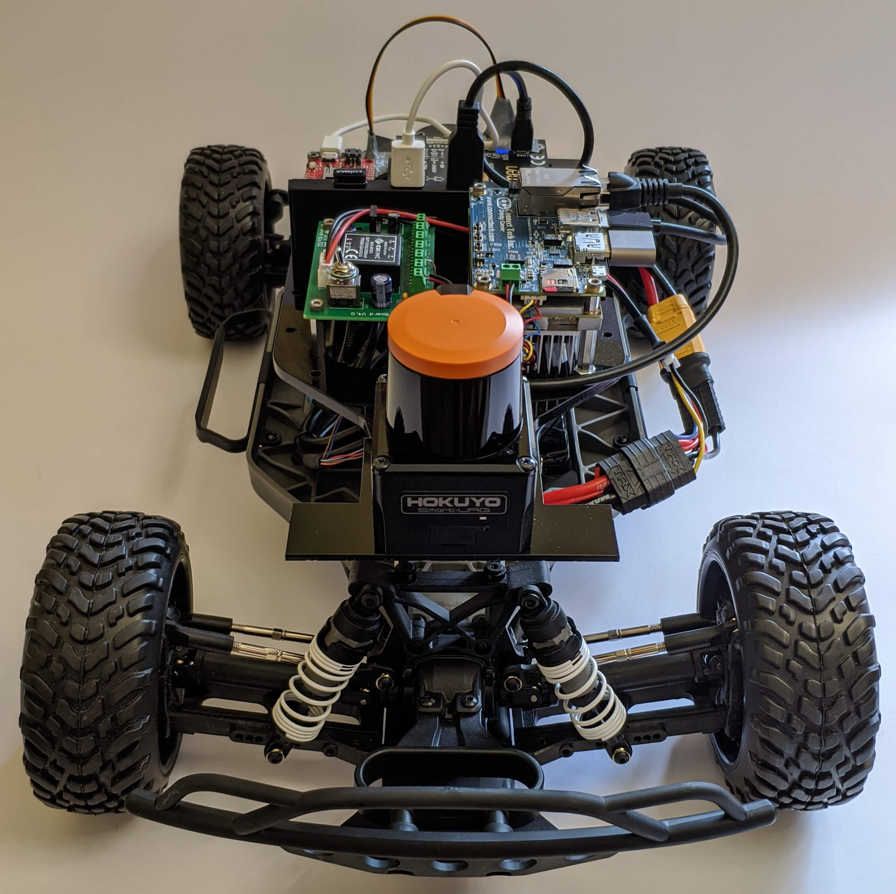
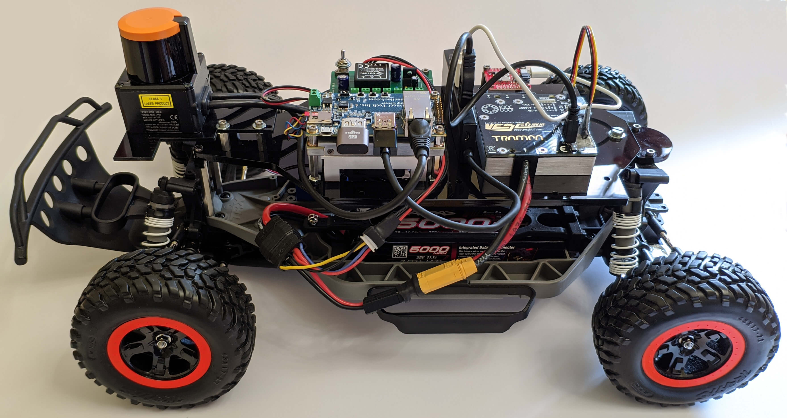

# F1TENTH-RL-BDI

Implementation of a BDI driver agent that uses BDI plans for high-level path planning and Reinforcement Learning for low level control.

This work is based on the [Jason-RL](https://github.com/MichaelBosello/jacamo-rl) framework and the [f1tenth-rl](https://github.com/MichaelBosello/f1tenth-RL) project. You can find additional useful documentation in those repo.

## Introduction

The [Jason-RL](https://github.com/MichaelBosello/jacamo-rl) framework allows to develop BDI agents that can learn some plans, called *soft-plans*, using Reinforcement Learning. The aim is to mix plans defined by the developer (*hard-plans*) and soft-plans.

In this project, we want to exploit the mixed plans approach for autonomous driving.

The BDI agent will handle the high-level planning of the path, deciding which direction should be taken. The RL plans will handle the low level control, using sensors and actuators to actually move without incident.

This approach is promising as RL struggles in high level pianification meanwhile humans struggles in hard-coding of low-level control. In this way, we can benefit from the strengths of both methods.

As a first step, we defined and trained a BDI agent (*agt/car_driver.asl*) that drives in a circuit, without high-level decisions, to test the RL control capabilities of the framework.

As a second step, we defined and trained a BDI agent (*agt/car_driver_intersection.asl*) that drives in a track with an intersection. There are two targets (randomly alternating), and the agent have to choose the right direction at the intersection to reach the proper target. The BDI hard plans define the high-level directions according to the agent position and the target to be reached. The learned soft-plans are three: *follow_street*, the car follow the path until a new known position is reached (see the map below); *go_forward*, at the intersection the car goes straight; *turn_left*, at the intersection the car turns to the left. The burden to perform actions at the intersection is given to soft-plans because we cannot blindly move forward or move left as even a small perturation will cause a crash if not fixed. 

[f1tenth-rl](https://github.com/MichaelBosello/f1tenth-RL) *can be used on both the real f1tenth car and on its simulator*.

Currently, this project has been tested only on the simulator for problem of space. We aim to bring the experiment on the physical car soon.

___
### f1tenth-RL (from the f1tenth-RL readme)
### (Deep Reinforcement Learning Autonomous Driving Using Lidar in the Physical World)

[[Report](http://apice.unibo.it/xwiki/bin/download/Courses/Sa1920Projects-LidarBosello/f1tenth-report.pdf)]
[[Project webpage](http://www.apice.unibo.it/xwiki/bin/view/Courses/Sa1920Projects-LidarBosello?language=en)]
[[Slides](http://apice.unibo.it/xwiki/bin/download/Courses/Sa1920Projects-LidarBosello/f1tenth-RL-slide.pdf)]
[[Video](https://youtu.be/ardg7-7Pevw)]

Implementation of *DQN* for autonomous racing using *lidar* data

It is designed to running on [f1tenth cars](https://f1tenth.org/)

*ROS* is used to control the car motor, servo and acquire the lidar data

*It can be used on both the real f1tenth car and on its simulator*

The DQN implementation provides several techniques to improve performances like target network, replay buffer, state history, prioritized sampling. It has various parameters (see below) that one can modify to fit the specific environment. There are also various options to pre-process lidar data. One can use lidar data directly or represent them as images containing the environment borders

Model saving, replay buffer serialization, and tensorboard logging are provided 

In our experiment, we want to test *DQN* training directly in the *real world* through realistic 1/10 scale car prototypes capable of performing training in real-time. This allows us to explore the use of RL for autonomous driving in the physical world in a cheap and safe way. In this setting, the driver agent faces all the problems of a not simulated environment, including sensors noise and actuators’ unpredictability. We start with the implementation of DQN on the car, and then we try various alterations to improve performance like reward function engineering and hyper-parameters tuning

### BDI-RL Framework (from the BDI-RL Framework readme)
This project is a PoC of the framework presented in 

***From Programming Agents to Educating Agents – A Jason-based Framework for Integrating Learning in the Development of Cognitive Agents***

[[DOI](https://doi.org/10.1007/978-3-030-51417-4_9)]
[[pre-print (free access)](https://cgi.csc.liv.ac.uk/~lad/emas2019/accepted/EMAS2019_paper_33.pdf)]
[[talk slides](https://www.slideshare.net/MichaelBosello/emas-2019-from-programming-agents-to-educating-agents)]

This is an integration of BDI agents and Reinforcement Learning.
It is based on [Jason](http://jason.sourceforge.net/wp/) (Actually, it is a [JaCaMo](http://jacamo.sourceforge.net/) project).

The basic idea is that a developer could write some plans and let the agent itself learn other plans and use them in a seamless way. This is not only for a specific ad hoc problem but as a general feature of the agent platform.

In short, the aim of the framework is to enable the developer to define the learning components with high-level abstractions as the BDI ones are. Then, these informations injeced by the developer are used by the agent to learn itself how to fulfill some tasks. 

The work of the developer moves from write plans to define a learning phase.
___

## Quick start
Build the project

	./gradlew build

Stop previous istances

	./gradlew --stop

Launch the f1tenth simulator:
+ Go to the working directory of the simulator (*/simulator*)

`$ source devel/setup.bash`

`$ roslaunch f1tenth_simulator simulator.launch`

Run the python agent server

	./gradlew runPythonAgent

Run the python environment server

	./gradlew runPythonEnv

Run the agent system:

	./gradlew run

## Installation

### Car simulator & RL algorithm

1) Install [ROS Melodic (desktop-full)](http://wiki.ros.org/melodic/Installation/Ubuntu)

2) Install the dependencies

    `$ sudo apt-get install python3-pip python3-yaml`

    `$ pip3 install rospkg catkin_pkg`

    `$ sudo apt-get install ros-melodic-ackermann-msgs`

3) __Optional__ dependencies

    You need to install these packets *only if* you want to use the relative function

    To visualize the images built from lidar data (lidar-to-image = True, show-image = True) you need opencv:

    `$ pip3 install opencv-python`

    To use compression of replay buffer (--compress-replay):

    `$ pip3 install blosc`

4) Setup the car simulator:

    `sudo apt-get install ros-melodic-map-server ros-melodic-joy`

    `$ mkdir -p simulator/src`

    `$ cd simulator/src`

    `$ git clone https://github.com/f1tenth/f1tenth_simulator.git`

    `$ cd ../`

    `$ catkin_make`

    Change the map (see below)

5) Install tensorflow 2.x.y

    `$ pip3 install tensorflow`

### Jason-RL framework
1) Install Java (>= 11)

	sudo add-apt-repository ppa:linuxuprising/java
	sudo apt update
	sudo apt-get install default-jre

2) install the python dependencies

	pip3 install flask flask-jsonpify flask-restful

## Experiments
In the end, the agent successfully learned a control policy, based on lidar data, to drive in a track with and without an intersection.
Tensorboard logging and trained models of experiments are provided in the release section. Maps used in simulated experiments are available in the */map* directory. If you want to use these maps, you must edit *simulator.launch* (see below) or copy the one provided in */map*

### Experimenting with parameters
If you run the python RL agent direcly with python instead of using gradle, you can change several parameters as command-line arguments. Use *-h* to see the argument help. 
Alternatively, You can check the list of arguments and change their default value in *rl_car_driver.py*

You can use the --model argument to load a trained model, e.g.:

from *python/agt/*

`python3 tf_env_rest.py --model=./run-bdi-hairpin-track-simulator-cnn1d/models`

### Simulator options:
+ The guide of the simulator is in the readme *simulator/src/f1tenth_simulator/README/md*

+ You may want to change the simulator options, check out *simulator/src/f1tenth_simulator/params.yaml*

+ If you want to change the track, you must edit *simulator/src/f1tenth_simulator/launch/simulator.launch*

    Search for `<arg name="map" default="$(find f1tenth_simulator)/maps/levine.yaml"/>`
    Change *levine* (the default map) with one map present in the folder *simulator/src/f1tenth_simulator/maps*
